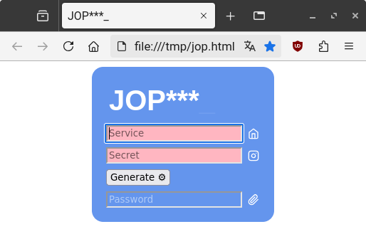
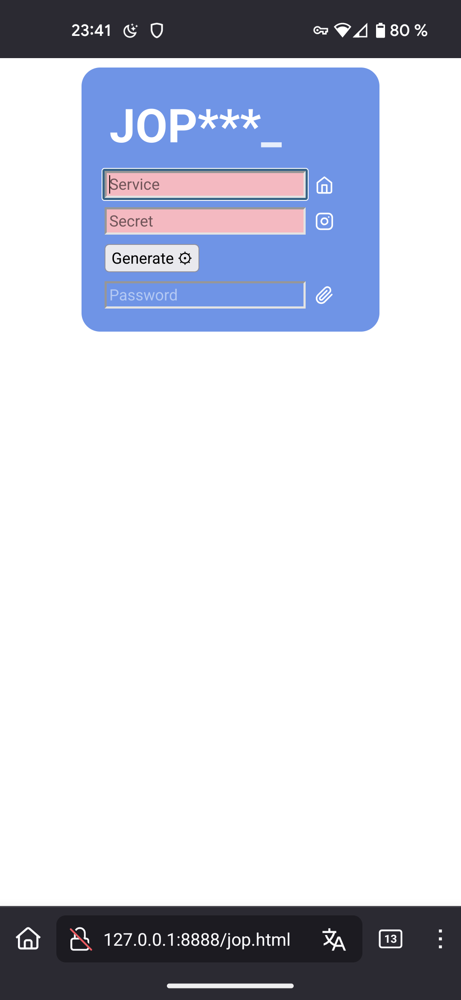
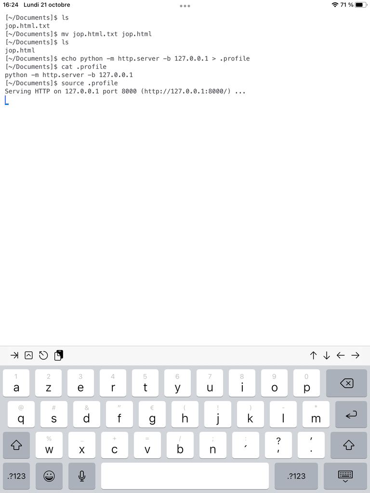
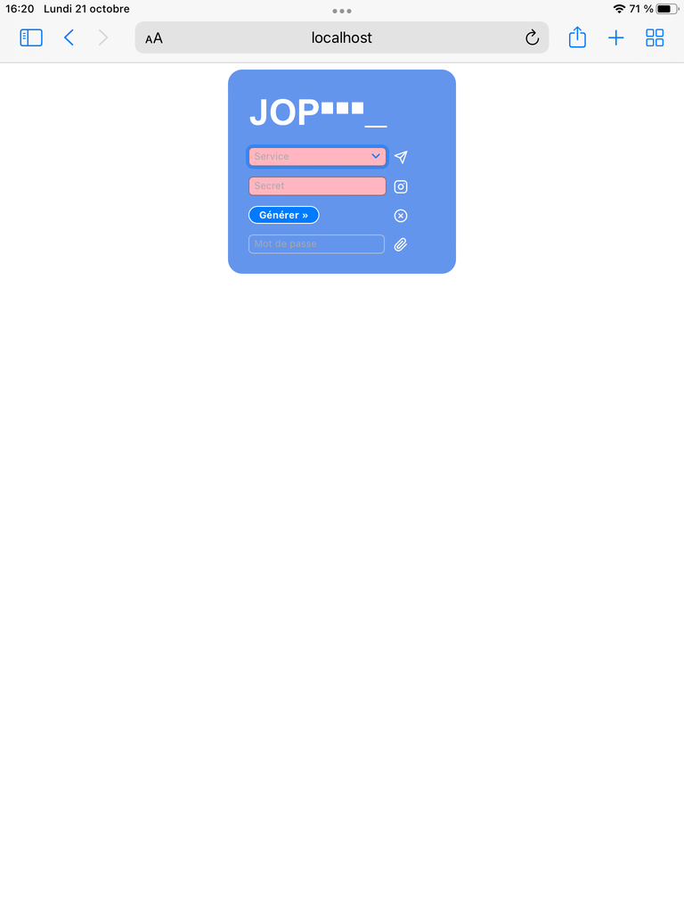

# JOP***_

**Générateur de mot de passe dans le navigateur** inspiré de « [lesspass](https://github.com/lesspass/lesspass), a stateless password manager ».

**JOP** - **J**ust **O**ne **P**assword - est une solution hors ligne extrêmement simple basée sur un petit fichier HTML-CSS-JS joué dans un navigateur web récent.

_Gérer une multitude de mots de passe uniques, longs et complexes n'a jamais été facile, même avec un gestionnaire de mots de passe interne ou externe, surtout lorsqu'on passe d'un navigateur à l'autre, d'un ordinateur à l'autre et d'un smartphone à l'autre !_

## Composition du mot de passe

Le service et le secret fournis sont combinés et mélangés à l'aide de la fonction cryptographique PBKDF2 pour produire un très grand nombre.
Ce nombre est ensuite utilisé pour sélectionner des caractères parmi un ensemble de 26 lettres minuscules de l'alphabet latin (`abcdefghijklmnopqrstuvwxyz`), les 26 lettres majuscules de l'alphabet latin (`ABCDEFGHIJKLMNOPQRSTUVWXYZ`), les 10 chiffres arabo-indiens (`0123456789`) et 25 caractères spéciaux (`(.,;:!?)[=+-*/&|]{#$%@_~}`).

> _Certains services n'autorisent pas l'utilisation de caractères spéciaux dans le mot de passe : le préfixe de service `-` empêche leur utilisation._ 
> _Certains services exigent un changement régulier du mot de passe : le préfixe de service permet de sélectionner un mot de passe parmi une liste de neuf candidats._

## Service, préfixe et secret

### Le service

Le service (et son éventuel préfixe) est l'une des deux informations à fournir et donc à mémoriser.
Le service doit comporter au moins 3 caractères.

> _Pour une meilleure mémorisation, il est préférable de choisir des formes simples et faciles à retenir : `gmail` et `yahoo`, par exemple, pour les services de courrier électronique respectifs, `pseudo1@gmail` et `pseudo2@gmail` pour distinguer deux comptes Gmail, etc…_

### Préfixe

Le préfixe, qui est facultatif et précède le service, est utilisé pour influencer la génération du mot de passe.
Il doit être séparé du service par au moins un espace et avoir la forme suivante `^((\+|-)?[1-9]? +)?` (eg. au début, éventuellement un plus ou un moins, éventuellement suivi d'un chiffre entre 1 et 9, le tout obligatoirement suivi d'au moins un espace).

Quelques exemples commentés de services préfixés valent parfois mieux qu'un long discours :
- `myservice`, `+ myservice`, `1 myservice` et `+1 myservice` (eg. pas de préfixe, `+`, `1` et `+1`) visent le même service `myservice` et généreront pour ce dernier un _premier mot de passe complet_
- `- myservice` et `-1 myservice` (eg. `-` et `-1`) visent le même service `myservice` et génèrent pour ce dernier un _premier mot de passe dégradé_ sans caractères spéciaux (eg. au cas où celui-ci n'en autoriserait pas l'usage)
- `2 myservice` ou `+2 myservice` (eg. `2` ou `+2`) visent le même service `myservice` et génèrent pour ce dernier un _second mot de passe complet_ (eg. si le premier mot de passe complet précédent a dû être modifié pour des raisons de sécurité)
- `-3 myservice` (eg. `-3`) cible le service myservice et génère pour ce dernier un _troisième mot de passe dégradé_ sans caractères spéciaux.

> _Le préfixe doit être séparé du service pour distinguer `2 myservice` (deuxième mot de passe complet pour le service `myservice`) de `2myservice` (premier mot de passe complet pour le service `2myservice`)._

### Secret

Le secret est l'une des deux informations à fournir et donc à mémoriser.
Aucune complexité n'est requise pour le secret, qui doit être composé d'au moins 3 caractères.

> _Cependant, il est préférable d'utiliser un secret robuste._

## Installation

### Ordinateur

- [Téléchargez](https://github.com/patatetom/jop/raw/refs/heads/main/jop.html) le fichier HTML `jop.html` sur votre ordinateur
- Vérifier le code
- Créez un raccourci sur le bureau qui ouvre votre navigateur préféré vers le fichier HTML (l'URL ressemblera à `file:///home/me/path/to/jop.html`).

### Smartphone / Tablette

> [!NOTE]
> _L'utilisation directe du schéma `file` (eg. `file:///path/to/jop.html`) dans l'URL est rendue difficile sur smartphone/tablette : il est donc nécessaire d'installer un serveur web sur le smartphone/tablette pour utiliser JOP en mode hors ligne._ 
> _Si vous ne souhaitez pas installer de serveur web sur votre smartphone/tablette, vous devez utiliser une version en ligne de JOP, soit en hébergeant vous-même le fichier HTML, soit en utilisant la [version fournie par GitHub](https://patatetom.github.io/jop/jop.html)._ 
> _Si vous choisissez d'utiliser JOP en ligne, il doit être servi via HTTPS et non HTTP._

> [!NOTE]
> _JOP utilise l'[élément HTML Data List](https://developer.mozilla.org/fr/docs/Web/HTML/Element/datalist) `<datalist>`, qui n'est pas encore supporté par Firefox sur smartphone/tablette (eg. Firefox mobile), ce qui empêche la présentation de la liste des services mémorisés._

#### Android

- Installer [Simple HTTP Server](https://play.google.com/store/apps/details?id=com.phlox.simpleserver)
- Définir un dossier vide comme `Root folder` (dossier racine)
- Restreindre les interfaces réseau à `lo` (eg. `127.0.0.1`)
- Définir `Autostart at boot` (démarrage automatique du serveur au démarrage du système)
- [Télécharger](https://github.com/patatetom/jop/raw/refs/heads/main/jop.html) le fichier HTML `jop.html` dans le dossier racine vide
- Vérifier le code
- Créez un raccourci sur l'écran d'accueil qui ouvre votre navigateur préféré vers le fichier HTML avec l'URL `http://localhost:8080/jop.html`.

 

#### iOS

- Installer [a-Shell-mini](https://apps.apple.com/us/app/a-shell-mini/id1543537943)
- Démarrez a-Shell-mini et exécutez la commande `echo python -m http.server -b 127.0.0.1 > .profile`
- Arrêtez (eg. commande `exit`) et redémarrez a-Shell-mini
- [Télécharger](https://github.com/patatetom/jop/raw/refs/heads/main/jop.html) le fichier HTML `jop.html`
- Déplacez `jop.html` dans le dossier a-Shell-mini
- Vérifier le code
- Créez un raccourci sur l'écran d'accueil qui ouvre votre navigateur favori vers le fichier HTML avec l'URL `http://localhost:8000/jop.html`

 

> _a-Shell-mini devra être redémarré si JOP ne peut pas être chargé/rechargé._ 
> _Le fichier HTML téléchargé peut avoir été sauvegardé avec l'extension `.txt` (eg. `jop.html.txt`) : dans ce cas, et après l'avoir déplacé, le fichier peut facilement être renommé depuis a-Shell-mini avec la commande `mv jop.html.txt jop.html`._

## Usage

### Génération de mot de passe

L'utilisation de JOP est relativement simple : entrer le service (éventuellement préfixé), entrer le secret, déclencher la génération du mot de passe et copier dans le presse-papier (pour un collage ultérieur) le mot de passe généré.

**Il est important de noter que le mot de passe copié dans le presse-papiers est librement accessible.**

> Pour la confidentialité, les informations saisies sont effacées lorsque le mot de passe généré est copié dans le presse-papiers, le secret est caché après 5 secondes d'observation et le secret est automatiquement effacé après 30 secondes d'inactivité.

### Exporter, importer et nettoyer des services

Les services mémorisés par le navigateur peuvent être exportés depuis l'interface JOP en utilisant l'icône dédiée : l'exportation consiste à copier une chaîne de caractères (eg. `?services=["myservice", "-2 autreservice"]`) dans le presse-papiers, qui sera ensuite utilisée pour une importation.

> _Cette chaîne de caractères peut facilement être éditée (corrigée, développée, etc…) en utilisant un simple éditeur de texte (comme `notepad` par exemple) avant d'être transmise pour l'importation._

Les services peuvent être importés dans JOP en ajoutant à l'URL utilisée la chaîne de caractères précédemment exportée depuis une autre instance de JOP : les services présents seront incorporés dans la liste existante des services mémorisés par le navigateur.

> _`file:///path/to/jop.html?services=["myservice", "-2 otherservice"]` importera les services `myservice` et `-2 otherservice` dans la liste existante._

Les services mémorisés par le navigateur peuvent être supprimés en ajoutant `?resetServices` à l'URL utilisée (eg. `file:///path/to/jop.html?resetServices`) : une confirmation sera demandée avant la suppression.

> _La liste des services mémorisés peut être facilement « nettoyée » en exportant la liste, en corrigeant l'exportation, en supprimant la liste et en important l'exportation corrigée._
