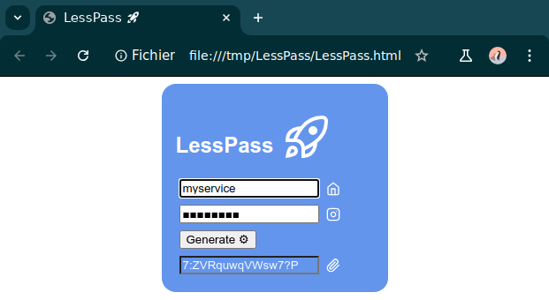
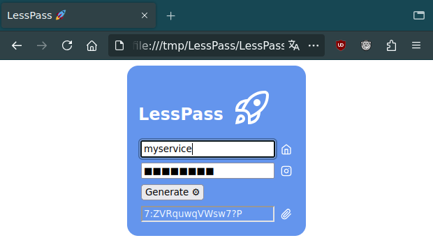
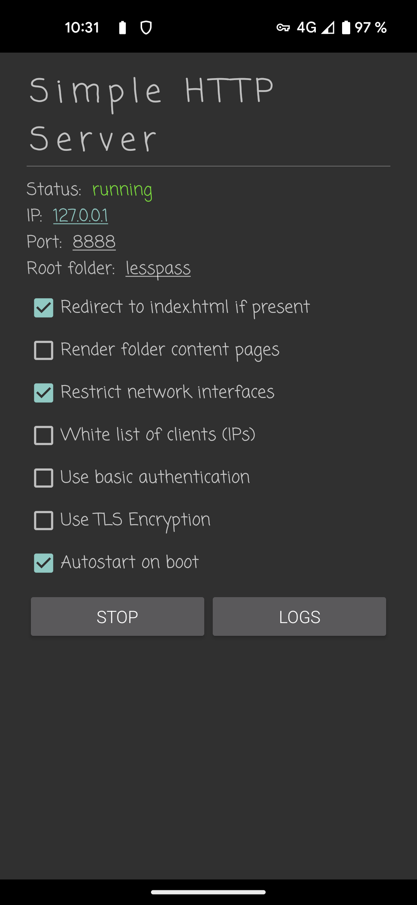
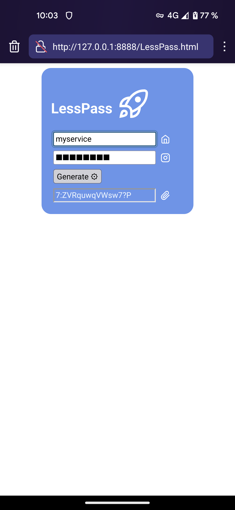

🔑 **In browser password generator** inspired by _« [lesspass](https://github.com/lesspass/lesspass), a stateless password manager »_.

LessPass is an extremely simple solution based on opening/playing/rendering a small HTML-CSS-JS file in a recent web browser (for user interface and password calculation).
LessPass works completely offline.


# Installation

## Computer

- Download `LessPass.html` HTML file to your computer
- Check the code
- Create a desktop shortcut that opens your favorite browser to the HTML file (the URL will look like `file:///home/me/path/to/LessPass.html`)

<br/>


## Smartphone

### Android

> _Direct use of the `file` schema (eg. `file:///sdcard/path/to/LessPass.html`) in the URL is made difficult by Android : it is therefore simpler to install a small web server._

- Install [Simple HTTP Server](https://play.google.com/store/apps/details?id=com.phlox.simpleserver)
- Set an empty folder as the `Root folder`
- Restrict network interfaces to `lo` (eg. `127.0.0.1`)
- Set `Autostart at boot`
- Download `LessPass.html` HTML file to the empty folder defined as `Root folder`
- Check the code
- Create a desktop shortcut that opens your favorite browser to the HTML file with `http://localhost:8080/LessPass.html` URL

 

### iOS

> _TODO..._<br/>
> _no iOS system yet : help would be appreciated._


## Translation

- Open the HTML file with your favorite code editor
- In the `language` section of the `script` section, copy/paste or rename the existing `fr(){…}` function
- Rename the new function with the two letters of the desired language
- Translate the few `"character strings"` present in the new function
- Save changes
- Reload the HTML file from your favorite browser

```js
// language (use fr template to create a new language) ------------------------
// french
function fr() {
	document.documentElement.lang = "fr";
	document.head.querySelector('meta[name="description"]').content = "Générateur de mot de passe";
	…}
// deutsch
function de() {
	document.documentElement.lang = "de";
	document.head.querySelector('meta[name="description"]').content = "Passwortgenerator";
	…}
```

> _Your translation is welcome ;-)_
